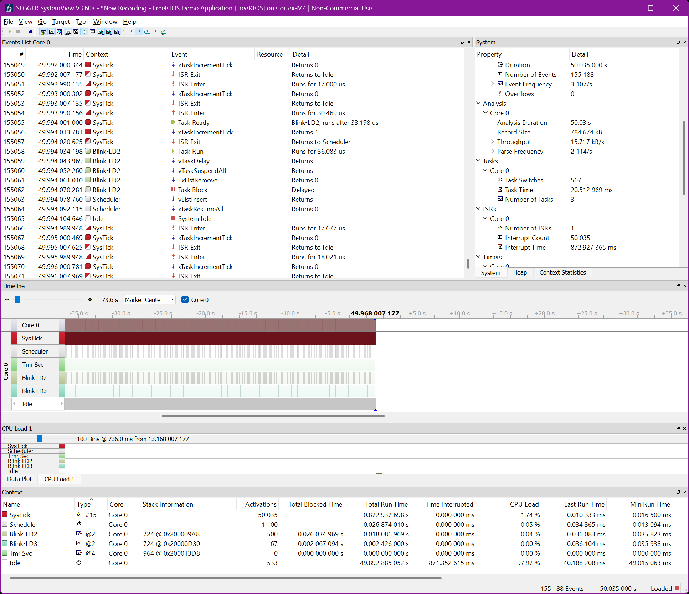

# Nucleo-F767ZI and Current FreeRTOS

* Author: [Douglas P. Fields, Jr.](mailto:symbolics@lisp.engineer)
* Date created: 2025-03-25
* Date updated: 2025-03-25
* License: Apache 2.0 for portions authored by Doug

## Overview

A project to integrate the current FreeRTOS,
which is 202406.01 LTS as of this writing,
into an STM32F7 project to serve as a basis
for doing the same for my existing
[Synthesizer Project](https://github.com/LispEngineer/stm-midi-poc1-sw).

## Components used

Hardware:
* Board: STM Nucleo-F767ZI

Software:
* STM32CubeIDE 1.18.0
* [Segger J-Link OB](https://www.segger.com/products/debug-probes/j-link/models/other-j-links/st-link-on-board/) replacement for ST-Link
* FreeRTOS 202406.01 LTS
* Segger SystemView v3.60a

## References

* [Udemy Course](https://www.udemy.com/course/mastering-rtos-hands-on-with-freertos-arduino-and-stm32fx/)

# Project Configuration

* IDE Configuration
  * NOTE: This is stored in a `.launch` file which is not in the
    repository per `.gitignore`
  * Debug
  * Debugger -> Debug Probe = SEGGER J-LINK
  
  
## Installing FreeRTOS

* Create `ThirdParty` top level directory
* Copy `FreeRTOS-Kernel` to this `ThirdParty` directory
* Delete the `examples` directory from `FreeRTOS-Kernel`
* Update `portable` subdirectory in `FreeRTOS-Kernel`
  * Delete everything but `GCC` and `MemMang`
  * In `GCC` subdirectory, delete everything but `ARM_CM7`
  * In `MemMang` subdirectory, delete everything but `heap_4.c`
* In the IDE, right-click `ThirdParty` and select Properties
  * Ensure `Exclude resource from build` is unchecked
* In the IDE, Project -> Properties
  * C/C++ Build
  * Settings
  * Tool Settings
  * MCU/MPU GCC Compiler
  * Include Paths
  * Add these:
    * Workspace -> ThirdParty/FreeRTOS-Kernel/include
    * Workspace -> ThirdParty/FreeRTOS-Kernel/portable/GCC/ARM_CM7/r0p1
* Set up the `FreeRTOSConfig.h`
  * There do not seem to be any demos in the v202406.01 LTS anymore.
  * One potentially relevant [`.h file`](https://github.com/FreeRTOS/FreeRTOS/blob/881305dcb813c93bd71e0ec2d3374cc741dec2bd/FreeRTOS/Demo/CORTEX_M7_STM32F7_STM32756G-EVAL_IAR_Keil/FreeRTOSConfig.h)
  * Update these settings from that demo:
    * `configUSE_TICK_HOOK`
    * `configCHECK_FOR_STACK_OVERFLOW`
    * `configUSE_MALLOC_FAILED_HOOK`
    * `configASSERT`
* In the `.ioc` file, we have to remove handlers that are provided by `port.c`
  * They are: `SVC_Handler`, `PendSV_Handler`, and `SysTick_Handler`
  * Open System Core -> NVIC
  * Open Code Generation under Configuration
  * In the `Generate IRQ handler` column, uncheck these rows:
    * Pendable request for system service
    * Time base: System tick timer
    * System service call via SWI instruction
  * Save the `.ioc` file and regenerate code
* Again, in the `.ioc` file, we need to update the STM32 HAL timebase
  * System Core -> SYS
  * Ensure the "Mode" pane can be seen; maybe pull down the "Configuration" pane
  * Change `Timebase Source` from `SysTick` to `TIM6`
  * System Core -> NVIC
  * Configuration pane, NVIC tab
  * Priority Group = "4 bits for pre-emption priority 0 bits for subpriority"
    * (This was already set)
  * Save the `.ioc` and regenerate the code

## Test FreeRTOS

* Create two tasks to blink the Nucleo LEDs 2 and 3
* Leave blinking of LED 1 for failure to start the scheduler
* No blinking of any LEDs will be a `configASSERT()` failure

Now, compile and load the board. The LD2 and 3 will blink
at different speeds.

# Set up for Segger SystemView

* [Documentation](https://kb.segger.com/FreeRTOS_with_SystemView)
  * Install the source code to `ThirdParty/SystemView`
  * Install the FreeRTOSV11 code there too
  * Add the include libraries to the GCC configuration
  * Add the define to the `FreeRTOSConfig.h`
  * Add `traceSTART();` to `main.c`

Build, load to the board (it should still work), and run
SystemView (v3.60a in my case) to see the output.

